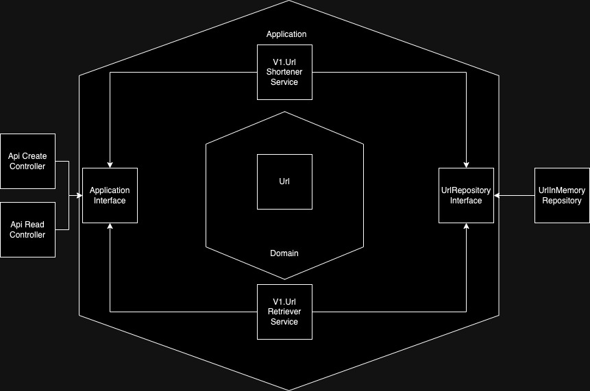

# 2. use hexagonal architecture

Date: 2024-10-27

## Status

Accepted

## Context

We need a flexible and maintainable architecture that allows for easy testing and adaptability to changes.
Hexagonal architecture, also known as ports and adapters architecture, provides a way to achieve this by decoupling the
core business logic from external concerns like databases, user interfaces, and other services.

## Decision

We will implement hexagonal architecture in our project. This involves structuring our codebase into three main layers:
- **Domain**: Contains the domain models.
- **Web**: Contains the web controllers and views.
- **Application**: Connects the domain to the external systems through ports and adapters.
- **Infrastructure**: Contains the implementations of external systems like databases, third party APIs, etc.

## Consequences

- **Positive**:
    - Improved testability: The core business logic can be tested independently of external systems.
    - Enhanced flexibility: Adapters can be easily swapped or modified without affecting the core logic.
    - Better separation of concerns: Clear boundaries between the business logic and external systems.

- **Negative**:
    - Initial complexity: Setting up the architecture may require more effort initially.
    - Learning curve: Team members may need to familiarize themselves with the principles of hexagonal 
